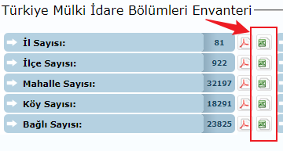
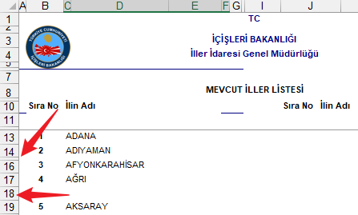
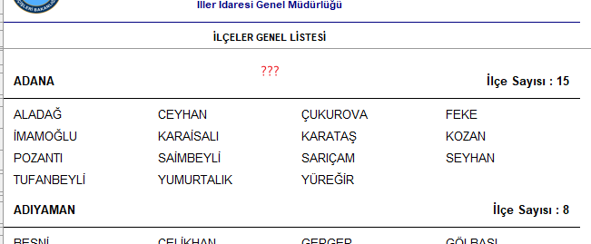
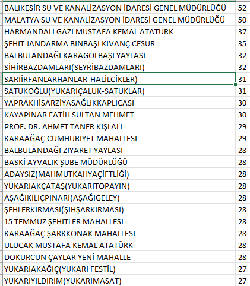

# Hazırlık

## Veri Kaynağı

İçişleri Bakanlığının [bu adreste](https://www.e-icisleri.gov.tr/Anasayfa/MulkiIdariBolumleri.aspx) yayınladığı mülki idare bölümleri envanterinden excel formatında dosyaları indirip kullanacağız.

Bu dosyaları [hamVeriOrj.zip](./hamVeriOrj.zip) içinde bulabilirsiniz.

## İlk Gözlemler

Dosyalar XLS formatında (binary 🤯) ve biraz dağınık:

Dolayısıyla pek de otomatize edilemeyecek bir şekilde (kan, ter ve gözyaşı ile) toparlanması gerekiyor. [Burada](hamVeri.txt) toparlanmışı mevcut:

## Sorunlar

_Her!?_ gerçek veri setinde olduğu gibi bazı _anormal_ durumlar var:

* Birden fazla kelimeden oluşan isimler: _BALBULANDAĞI KARAGÖLBAŞI YAYLASI_
* Parantez ile ayrılmış ek bilgiler: _ELÇİNİNENİŞALTI(ELMALIDERE)_
* "-" ile ayrılmış ek bilgiler: _ULAŞLI-YAVUZ SULTAN SELİM_
* Rakam veya noktalama içeren isimler: _ATAKÖY 2. 5. 6. KISIM_
* Emin değilim ama:
  * Çok kısa: _OF_
  * Farklı bir gramer: _HABİB-İ NECCAR_

### ⚠️

> Harf seviyesinde bir dil modeli oluşturacağımız için _normal_ durumumuz sadece Türkçe harflerden oluşan (münferit) kelimeler; yer isimlerinin aslında pek de uygun bir veri seti olmadığını şimdi anlıyorum ama olsun, bu da bir tecrübe.

## Temizlik

Neden böyle yaptın sorusuna gerçekten verebileceğim bir [cevap](https://www.youtube.com/watch?v=erEXERGN80o) yok ama şöyle temizledim ve [tam 30.000 isim kaldı](../isimler.txt):

* Ayraç içerenleri (ayraçtan 🙃) ayırıp tüm kısımlarını kümeye ekledim.
* Birden fazla kelimeden oluşanları sildim.
* 3 ve daha az harften oluşanları sildim.

### 📢

>Anlatımın kısa olduğuna aldanmayın bu iş için 5-6 saatlik efor harcadım (belki benim beceriksizliğim ama bunu işten saymamak -_hele_ hatırı sayılır bir veri seti üzerinde işlem yapılacaksa- en naif ifade ile aymazlık olarak nitelendirilebilir).
